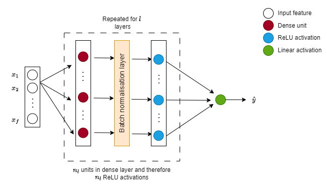

# :deciduous_tree: GreenValueNet :ocean:
GreenValueNet is my attempt to use machine learning to value environmental ammenities using hedonic pricing. A deep neural network can outperform gradient boosting and random forest regressions in terms of mean squared error, and enables automatic calculation of gradients used to estimate the value of open space and other environmental ammenities. This approach draws on the hedonic pricing model outlined by [Gibbons, Mourato and Resende (2013)](https://link.springer.com/article/10.1007/s10640-013-9664-9).
## Table of Contents
- [Introduction](#introduction)
- [Dataset](#dataset)
- [Model](#model)
  - [Loss function](#loss-function)
  - [Baseline models](#baseline-models)
  - [Model structure](#structure)
- [Results](#results)
  - [Valuation](#valuation)
  - [Model performance](#model-performance)
- [Potential improvements](#potential-improvements)
  - [Model improvements](#model-improvements)
  - [Dataset improvements](#dataset-improvements)

## Introduction
Hedonic pricing values environmental attributes using property sale data. Controlling for property and non-environmental local charactistics, variation in property prices can be used to approximate the value people place on the existence of environmental attributes near to where they live. This approach is widely used in environmnetal economics for localised features such as urban air quality.  

To my knowledge, few attempts to use hedonic pricing to value environmental attributes at a more national level exist, one example being Gibbons, Mourato and Resende (2013). Most existing approaches also use bayesian or traditional regression models, whereas my approach leverages machine learning techniques including neural networks.

Having formulated a model that uses property and local characteristics to predict house prices, partial derivatives can be used to construct marginal valuation curves for various housing characteristics.

$$ V(x) = \frac{\partial \ln(\text{price})}{\partial x} \text{ for } x_1, x_2, \ldots, x_f $$

where:
- $V(x)$ is value of feature $x$
- $\ln(price)$ is the natural logarithim of price
- $f$ is the number of environmetal features

As well as sketching these functions, I follow the literature in evaluating these functions at the median house price to get a numerical estimate for the valuation, and report in the results section.

## Dataset

The dataset is constructed by combining property sale data by full postcode with environmental attribute data from various sources. The final processed dataset consists of almost 13 million property sales across England from 1985 to 2022 complete with property and local characteristics. All data processing was done in python. [More information is available in Annex 1.](#annex-1)

## Model

### Loss function

A mean squared error (MSE) loss function was used for the regression problem. Not only is this a common approach in machine learning regression problems, but the MSE loss function is more sensitive to outliers than an absolute error loss function. Given the plausibility of extreme values at the upper end of the house prices, the MSE loss was used to penalise these observations without completely disregarding the information they contain. THe model therefore aims to minimise the following:

$$ L(y, \hat{y}) = \frac{1}{n} \sum_{i=1}^{n} (y_i - \hat{y}_i)^2 $$

where:
- $L(y, \hat{y})$ is the mean squared error (or loss)
- $n$ is the number of samples
- $y_i$ is the observed value of the ith observation in the dataset
- $\hat{y}_i$ is the predicted value of the ith observation in the dataset

### Baseline models

A variety of regression models were considered as benchmark models. As the regression problem was complex, a linear model was unlikely to be informative and given the ease of deploying machine learning models using packages such as `sci-kit learn`, a `RandomForestRegressor` and `GradientBoostingRegressor` were used for baseline models. In both cases hyperparamter tuning was conducted. The gradient boosting regressor performed better against the mean squared error (MSE) metric and the random forest also triggered memory issues when ran locally.

### Structure [pending]

The deep neural network is set up as below. The latest version of models are saved in [`outputs/models`](outputs/models) and a log of model iterations `model_log.csv` is available in [`outputs`](outputs).

Through various iterations of hyperparameter tuning and model modifications, the hyperparamter values are:

- Number of layers $\mathcal{l} = 10$
- Number of input features $n_x = 21$
- Number of hidden units $n_l = 24$
- Learning rate $\alpha = 0.01$
- Number of  $epochs = 69$

Batch normalisation was also introduced during the iteration process, and he initialisation was used for relu layers, with glorot normal initialisation for the output layers to combat the issue of vanishing gradients that was experienced in early model runs.

## Results

### Valuation [pending]

**TODO** plot the gradients

### Model Performance [pending]

**TODO** plot the model accuracy

## Potenital improvements

### Model improvements

One of the main limitations in model improvement has been local memory and processing power. Potential improvements include:
- **Increasing computational power**
  - Sites such as Google colab offer free GPU credits, so this could be investigated to increase computing power
  - This would enable further hyperparameter tuning of the random forest and gradient boosting baselines, but would also allow a fuller randomised hyperparameter search for the neural network. 
- **Allowing number of units to vary between layers**
  - For simplicity, so far only network structures where the number of units in each layer is constant across all hidden layers. This could be relaxed to allow for a more complex model.

### Dataset improvements

The dataset could be further modified to explain more of the variation in house prices and therefore improve the accuracy of the model. Computational power acts as a major constraint here.

Potential modifications include:
- **Increasing the scope of the dataset**
    - Widening the dataset from England to UK given many of the inputs cover regions of the UK besides England
- **Increasing number of explanatory variables of house price**
    - Including economic indicators such as interest rates or gdp growth
    - Including year and region dummy indicators
    - Other property specific characteristics such as garden size could be useful for capturing willingness to pay for environmental ammenities
    - Using school catchment areas rather than striaght line distances for closest school, and including school quality explicitly (i.e. latest Ofsted inspection) as a measure of school quality
- **Using proportions of nearby land use categories [in development]**
    - The proportion of the square km that a property is located in covered by various land use types will enable the model to capture more information on valuation of nearby environmental attributes i.e. cropland vs forest etc.
- **Imputing missing values**
    - There are ~1mn property sales missing key variables such as number of rooms and floor space. A K-nearest neighbours imputation exercise was attempted but was aborted due to run time and memory issues. Successfully imputing these missing values would enable a larger training set to train the model
    - However, it is not recommended to do imputation for the postcodes that have no matching ONS ward code and therefore miss environmental attribute data. Whilst these are input features in the model, they are key variables that we calculate values for afterwards, and thus imputation may not be appropriate.

## Annex 1

### Data Processing

The input downloads can be found in the file [`data_catalogue.yml`](data_catalogue.yml) with more details below. Where raw files have been renamed, the catalogue should be updated to reflect this.

The following datasets should be downloaded into [`data/raw_inputs`](data/raw_inputs):
- [National Parks](https://naturalengland-defra.opendata.arcgis.com/datasets/d333c7529754444894e2d7f5044d1bbf_0/about)
- [National Trust open space](https://open-data-national-trust.hub.arcgis.com/datasets/3511d41489ae442c877db40698b3b0c9_0/explore?location=52.824441%2C-2.103324%2C6.78)
- [OS open road map](https://osdatahub.os.uk/downloads/open/OpenRoads)
- [Postcodes](https://osdatahub.os.uk/downloads/open/CodePointOpen)
- [Schools](https://get-information-schools.service.gov.uk/Downloads)
- [Coastlines](https://osdatahub.os.uk/downloads/open/BoundaryLine)
- [Ward characteristics](ttps://www.gov.uk/government/statistics/generalised-land-use-database-statistics-for-england-200)
- [House prices](https://reshare.ukdataservice.ac.uk/855033/)
- [Travel to Work Areas (TTWAs)](https://geoportal.statistics.gov.uk/datasets/ons::ttwa-dec-2001-generalised-clipped-boundaries-in-the-uk/explore)

The file names of downloaded datasets should match the names in [`data_catalogue.yml`](data_catalogue.yml) - if not this file should be updated to reflect the updated names. Once downloaded, the script [`pre_processing_funcs.py`](pre_processing_funcs.py) should be run. Then the full dataset can be generated by either running the [`processing_funcs.py`](processing_funcs.py) script or running the first 2 cells in [`GreenValueNet.ipynb`](GreenValueNet.ipynb). At the end of this a file called `dataset.csv` should be saved in `data/interim_files`.

In the latest version of the model, `dataset` had ~13mn observations of property sales with 23 input features and 3 identifying features. 

The following datasets are not currently used in the model:
- Land cover [development in progress]
- Railway stations

Where necessary, string variables have been converted to integers using integer encoding. If necessary, this can be replaced with one-hot encoding. Numerical features are normalised using z-normalisation to speed up learning and be more robust to outliers than a simple max/min normalisation. A natural log of the output variable property price is taken to give the target variable `ln_price`.

### Data sources

**Land cover**

For the land cover raster, an account with the UK Centre for Ecology and Hydrology is needed to download the map. I will use the Land Cover Map 2017 (GB) 20m rasterised map. From this, 1km grid of the UK can be constructed and I will calculate the proportion of each land use type in each grid cell. Property location will then be matched to this grid using the centre point of each full postcode.
For licensing reasons I am not able to incorporate the downloading of this dataset within the data_processing script but it can be accessed by requesting download [here](https://order-eidc.ceh.ac.uk/orders/DS6HRVEC).

*Morton, R. D., Marston, C. G., O’Neil, A. W., & Rowland, C. S. (2020). Land Cover Map 2017 (20m classified pixels, GB) [Data set]. NERC Environmental Information Data Centre. [ Available here.](https://doi.org/10.5285/F6F86B1A-AF6D-4ED8-85AF-21EE97EC5333)*

**National Parks**

The national parks shapefile was downloaded from the Natural England Open Data Publication, a Defra group ArcGIS Online Organisation. It contains all the national parks of England as polygons. The distance of each postcode centre point to the closest national park was then calculated. *[Available here.](https://naturalengland-defra.opendata.arcgis.com/datasets/national-parks-england/explore)* (Accessed: 21/11/2023)

**National Trust**

The National Trust shapefile was downloaded from the National Trust Open Data site, with the Always open version being selected for use as a better measure of natural amendity than ticketed estates. These areas are stored as polygons. The distance of each postcode centre point to the closest national trust land site was then calculated. *[Available here.](https://open-data-national-trust.hub.arcgis.com/datasets/3511d41489ae442c877db40698b3b0c9_0/explore?location=52.824441%2C-2.103324%2C6.78)* (Accessed: 21/11/2023)

**Roads**

The roads shapefiles are from the OS Data Hub and covers all raods in the UK. The shapefile is split into 100km^2 tiles. These were merged together in `pre_processing_funcs.py` and filtered to include only A-roads and motorways as line strings. The distance of each postcode centre point to the closest main road was then calculated. *[Available here.](https://osdatahub.os.uk/downloads/open/OpenRoads)* (Accessed: 22/11/2023)

**Postcodes**

The coordinates of the centre of each postcode are extracted from the OS Data Hub across 120 csv files in in EPSG:27700 projection. These were merged together in `pre_processing_funcs.py` and filtered to include only English postcodes. They were also converted to be EPSG:3857 to match all other shapefiles. *[Available here.](https://osdatahub.os.uk/downloads/open/CodePointOpen)*. (Accessed: 21/11/2023)

**Schools**

School location and ratings data was downloaded from the UK government data download portal page. This file should be saved with UTF-8 encoding. Whilst the ratings are not currently used, this dataset was filtered for primary and secondary school and was split into two along these categories. The postcode point shapefile was merged with the school data and used to calculate the distance between each postcode and the closest school. *[Available here.](https://get-information-schools.service.gov.uk/Downloads)*. (Accessed: 24/11/2023)

**Coastline**

A UK coastline polygon is constructed from boundary lines polygons downloaded from the OS data hub. The boundaries are joined together and the outline is taken to be the coastline, and stored as a line string. The distance of each postcode centre point to the closest point of coastline was then calculated. *[Available here.](https://osdatahub.os.uk/downloads/open/BoundaryLine)* (Accessed: 22/11/2023)

**Ward characteristics**

The Generalised Land Use Database is used to get information at the ward level on:
- Domestic building density
- Non domestic building density
- Garden density
- Greenspace density
- Water density (i.e. proportion of land that is river/lake)
- Path density

`ONS_code` is matched to postcode using ONS UPRN Directory (May 2018) *[here](#https://geoportal.statistics.gov.uk/datasets/ons::ons-uprn-directory-may-2018-1/about)* using `ward_code`. The GLUD is *[availabe here](https://www.gov.uk/government/statistics/generalised-land-use-database-statistics-for-england-200)*. (Acessed 22/11/2023)

**House Prices**

House price data was obtained from the UK Data Service House Price per sq metre dataset.Specific variables were then extracted and property locations were matched to environmnetal attributes based on full postcode. *[Available here](https://reshare.ukdataservice.ac.uk/855033/)*. (Accessed 21/11/2023)

*Chi, Bin and Dennett, Adam and Oléron-Evans, Thomas and Morphet, Robin (2021). House Price per Square Metre in England and Wales, 1995-2021. [Data Collection]. Colchester, Essex: UK Data Service. 10.5255/UKDA-SN-855033*

**Travel To Work Areas (TTWAs)**

TTWAs are areas where >75% of the economically active population work in the area, and 75% of the working population live in the area. This shapefile contains TTWAs from the ONS geography geoportal. The distance from the centre of a postcode to the centre of the nearest travel to work area was then calculated. *[Availabe here](https://geoportal.statistics.gov.uk/datasets/ons::ttwa-dec-2001-generalised-clipped-boundaries-in-the-uk/explore).* (Accessed 27/11/2023)

**Train Stations**

This shapefile contains the locations of all train stations in the UK as points. Due to difficutlies assigning the missing CRS, this variable has been excluded for now. *[Availabe here](https://datashare.ed.ac.uk/handle/10283/2423).* 

*Pope, Addy. (2017). GB Railways and stations. University of Edinburgh. https://doi.org/10.7488/ds/1773.*
